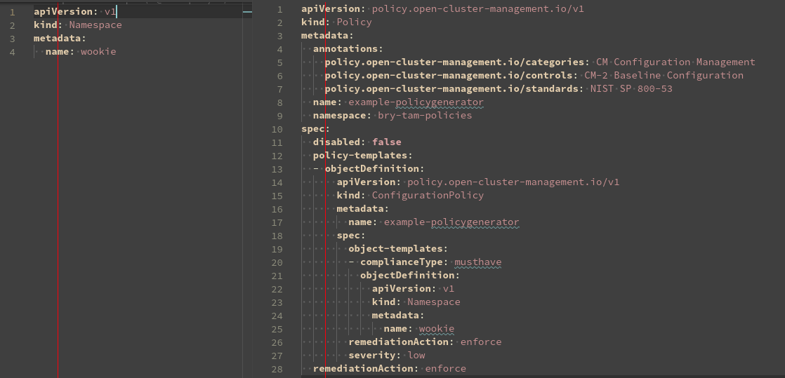

# Tips for using templating in Governance Policies - Part 1

**Author:** Brian Jarvis

## Introduction

Red Hat Advanced Cluster Management for Kubernetes (RHACM) Governance provides an extensible framework for enterprises to introduce their own security and configuration policies that can be applied to managed OpenShift or Kubernetes clusters. For more information on RHACM policies, I recommend that you read the [Applying Policy-Based Governance at Scale Using Templates](https://cloud.redhat.com/blog/applying-policy-based-governance-at-scale-using-templates) and [Comply to standards using policy based governance](https://cloud.redhat.com/blog/comply-to-standards-using-policy-based-governance-of-red-hat-advanced-cluster-management-for-kubernetes) blogs.

In this multi part blog series I showcase a number of techniques you can use when using templates in your RHACM Policies. In part one I will review practices you can use to make your templates more readable and easier to maintain.

**Prerequisites**:
  - [Review Governance Policy Templates and template functions](https://access.redhat.com/documentation/en-us/red_hat_advanced_cluster_management_for_kubernetes/2.7/html-single/governance/index#support-templates-in-config-policies)

## Use PolicyGenerator to manage code
If you are not familiar with [PolicyGenerator](https://access.redhat.com/documentation/en-us/red_hat_advanced_cluster_management_for_kubernetes/2.7/html-single/governance/index#policy-generator) I recommend you read the [Generating Governance Policies Using Kustomize and GitOps](https://cloud.redhat.com/blog/generating-governance-policies-using-kustomize-and-gitops) blog post.

The PolicyGenerator greatly simplifies management of your policies by allowing you to focus on the configuration to be applied. The generator configuration lets you control the specifics of the Policy that is generated.

Here you can see the difference in required code to create a simple namespace.

## "eq" function instead of || to compare 1:n
In the case where we want to compare and test an object to see if it equals one out of multiple values we would normally write our if statement as follows:
~~~
$myObject == Arg1 || $myObject == Arg2  || $myObject == Arg3
~~~

But in Go the `eq` is a [function](https://pkg.go.dev/text/template#hdr-Functions). This allows us the power to evaluate all arguments against the object. The above could be written as this instead
~~~
eq $myObject Arg1 Arg2 Arg3
~~~

Let's look at a full example. Suppose we wanted our clusters in production and staging to use a different number of replicas for the IngressController compared to other environments. We would write a policy similar to below
~~~
apiVersion: operator.openshift.io/v1
kind: IngressController
metadata:
  name: default
  namespace: openshift-ingress-operator
spec:
  httpEmptyRequestsPolicy: Respond
  replicas: '{{ if eq (fromClusterClaim "env") "production" "staging" -}} 6 {{- else -}} 2 {{- end }}'
~~~

## Use ternary instead of if/else statements
In the previous example we used if the environment is "production" or "staging" set the number of replicas to 6 otherwise set the replicas to 2.

Above I used an if/else statement to highlight the `eq` function, a better and more concise way to achive this would have been to use a `ternary` [function](https://masterminds.github.io/sprig/defaults.html). The `ternary` function returns the first value if the test value is true and will return the second value if the test is false or an empty value.

Rewriting the above we can see how much easier it is to read. Note the test value can be piped into the `ternary` function or listed as the third argument.
~~~
apiVersion: operator.openshift.io/v1
kind: IngressController
metadata:
  name: default
  namespace: openshift-ingress-operator
spec:
  httpEmptyRequestsPolicy: Respond
  replicas: '{{ (eq (fromClusterClaim "env") "production" "staging") | ternary 6 2 }}'
~~~

## printf to format and concatenate strings
The `printf()` [function](https://pkg.go.dev/fmt) takes a templated string which contains the text to be formatted plus some annotated verbs that tell the function how to format the remaining arguments.

Instead of using multiple template blocks like
~~~
{{ fromClusterClaim "env" }}-mycluster-{{ fromClusterClaim "name" }}
~~~

We can use the `printf()` function to rewrite it as
~~~
{{ printf("%s-mycluster-%s", (fromClusterClaim "env"), (fromClusterClaim "name")) }}
~~~

`printf()` also allows formatting of the data using a wide array of verbs. Some of the most commonly used verb specifiers are:
- %v – formats the value in a default format
- %d – formats decimal integers
- %g – formats the floating-point numbers
- %b – formats base 2 numbers
- %o – formats base 8 numbers
- %t – formats true or false values
- %s – formats string values

You can also explicitly specify which argument index to use with the verb. This allows you to control where the argument is used, instead of the default successive behavior, and also use an argument multiple times. The templated text is considered zero(0) in the indexed array so arguments will start with a one(1).
~~~
{{ printf("%[1]s-mycluster-%[1]s", (fromClusterClaim "env")) }}
~~~

## Setting default values
When creating policies that use data from other objects we want to prevent errors by ensuring a value gets defined. Maybe your policy is dependent on a value in a ConfigMap created by another Policy or the output of a lookup that might not return a value. To ensure our Policy is generated as expected we can use the `default` [function](https://masterminds.github.io/sprig/defaults.html) to ensure a value is produced.

Supopose we wanted our IngressController to set the replica count to the number of infra nodes. To prevent a condition where there are no Ingress pods we want to default to a count of 2. Because this policy could be applied before infra nodes are created or our lookup could unexpectedly return an empty set, we want to ensure we have a default value defined.

Also note we are making use of a feature introduced in RHACM 2.8 using labels to limit the [lookup function](https://access.redhat.com/documentation/en-us/red_hat_advanced_cluster_management_for_kubernetes/2.8/html-single/governance/index#lookup-func) to only return nodes with the infra role.
~~~
apiVersion: operator.openshift.io/v1
kind: IngressController
metadata:
  name: default
  namespace: openshift-ingress-operator
spec:
  httpEmptyRequestsPolicy: Respond
  replicas: '{{ (len (lookup "v1" "Node" "" "" "node-role.kubernetes.io/infra").items | default 2) | toInt }}'
~~~

## Using managed cluster data in hub templates
Previous versions of RHACM made the ManagedCluster name available to hub templates by using the `.ManagedClusterName` context variable. This was useful when you needed to include the name of the cluster in your template.

Starting with RHACM 2.8 a new context variable `.ManagedClusterLabels` is available to allow access labels applied to the ManagedCluster. This new variable greatly simplifies getting information about the ManagedCluster that is stored in labels.

Previously to access the value of a region label you would have to use the lookup function to access the `ManagedCluster` object and read the metadata of the return object.
~~~
region: '{{hub (lookup "cluster.open-cluster-management.io/v1" "ManagedCluster" "default" .ManagedClusterName).metadata.labels.region hub}}'
~~~

The above can now be replaced with this much more concise and easier to read hub template. Additionally, this removes a call to the apiserver during Policy evaluation.
~~~
region: '{{hub .ManagedClusterLabels.region hub}}'
~~~

Note if the label you want to reference has special charactors in the name like dashes, periods, or forward slashes you will receive an error such as "template: tmpl:17: bad character U+002D '-'".  To use these labels with the `.ManagedClusterLabels` context variable we can index the labels.
~~~
channel: '{{hub (index .ManagedClusterLabels "openshiftVersion-major-minor") hub}}'
~~~

## Copy entire ConfigMaps and Secret data
There are many use cases where a Policy needs to copy an entire Secret from one namespace to another or from the Hub to a Managed cluster. RHACM 2.8 introduced two new templating functions to make this easier.

In RHACM 2.7 and earlier a Policy had to template every key from the Secret or ConfigMap. This was a repetitive task that needed frequent updates as new data was added to the reference object.
~~~
apiVersion: v1
kind: Secret
metadata:
  name: admission-control-tls
  namespace: stackrox
data:
  admission-control-cert.pem: '{{hub fromSecret "my-policies" "admission-control-tls" "admission-control-cert.pem"  hub}}'
  admission-control-key.pem: '{{hub fromSecret "my-policies" "admission-control-tls" "admission-control-key.pem" hub}}'
  ca.pem: '{{hub fromSecret "my-policies" "admission-control-tls" "ca.pem" hub}}'
type: Opaque
~~~

RHACM 2.8 introduced the `copySecretData` and `copyConfigMapData` [functions](https://access.redhat.com/documentation/en-us/red_hat_advanced_cluster_management_for_kubernetes/2.8/html-single/governance/index#copysecretdata-function) which can be used to copy all data keys from the reference object. These functions are also available in Hub templates to copy the reference object from the Hub to managed clusters.
~~~
apiVersion: v1
kind: Secret
metadata:
  name: admission-control-tls
  namespace: stackrox
data: '{{hub copySecretData "my-policies" "admission-control-tls" hub}}'
type: Opaque
~~~

## Summary
In part one of this series I outlined the usage of a number of template functions and examples you can use to make your templates easier to read and maintain. In part two we will look at how to use the `raw-object-templates` to expand templates for more complex use cases.
